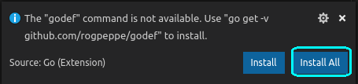

# **Çalışma Ortamı Kurulumu**

## **Temel Kurulumlar***

* ### Hangi İşletim Sistemi Kullanıyoruz
Biz geliştirmeleri **"Ubuntu 18.04 LTS - bionic"** işletim sisteminde gerçekleştiriyoruz. İndirmek için;

  > https://www.ubuntu.com/download/desktop

* ### Sistem Gereksinimleri
Cihazınıza bazı indirmeniz gereken programlar bulunmaktadır. Bunları indirmek için terminal ekranınızda aşağıdaki komutları çalıştırınız.

* #### Git Yüklemek
 ``` bash
sudo apt-get install git -y
```
* #### GO Yüklemek
``` bash
wget https://dl.google.com/go/go1.11.5.linux-amd64.tar.gz
sudo tar -C /usr/local -xzf go1.11.5.linux-amd64.tar.gz

mkdir ~/go
mkdir ~/go/pkg
mkdir ~/go/src
mkdir ~/go/bin

echo "#GOLANG Settings" >> ~/.profile
echo export GOPATH=\$HOME/go >> ~/.profile
echo export PATH=\$PATH:\$GOPATH/bin >> ~/.profile

sudo su
echo export PATH=\$PATH:/usr/local/go/bin >> /etc/profile
exit

source ~/.profile
```
**Bu işlemlerden sonra cihazınızı yeniden başlatınız.**

## **IDE Kurulumu**

### **IDE Nedir ?**
**IDE** kısaltmasının açılmış hali **"Integrated Development Environment"** demektir. Türkçe çevirisi **"Entegre Geliştirme Ortamı"** dır.

Aslında **IDE** bizim **yazılım projelerimizi**, rahat **programlayabilmek** için bir çok imkan sağlayan **geliştirme ortamıdır**. **Renklendirme, otomatik düzenleme, hata denetimi gerçekleştirme, derleme, çalıştırma, fonksiyonlar ve sınıflar arası gezinme** gibi bir çok kolaylıklar sağlamaktadır.

Proje ne kadar büyük ve karmaşıksa, **IDE** gereksinimi o kadar artmaktadır.  

### **Hangi IDE'leri Kullanabiliriz**
**GO**, bir text editörüyle bile çok rahat geliştirilebilmektedir. Bunun için bazı araçlar indirmek yeterlidir. Ama bir çok **IDE** seçeneğide bulunmaktadır. Bunlardan en çok kullanılanları;

#### **Geliştirme Ortamları Listesi ;**
> https://github.com/golang/go/wiki/IDEsAndTextEditorPlugins

#### **VIM ;**
> https://www.vim.org/

#### **Visual Code ;**
> https://code.visualstudio.com/

#### **Atom ;**
> https://atom.io

#### **Goland (ücretli) ;**
> https://www.jetbrains.com/go/
  

### **Biz Hangi IDE de Kod Geliştirdik, Neden?**
Biz kodlarımızı **"Visual Code"** da geliştirdk. Bunun amacı, çoğu **IDE** de olduğu gibi otomatik bazı işleri **yapmıyor** oluşu. Yani program sırasında otomatik bazı dosyaları oluşturmuyor. Yada arka planda kolaylıklar **sağlamıyor**. Her şey bizim kontrolümüz altında oluyor. **İlk öğrenme sırasında** otomatik olan işlemler, belki bazı konuları kavramada zorluk yaşatabilir. Fakat siz gönlünüzden hangi ortamda kod yazmak istiyorsanız onu seçebilirsiniz. Hatta daha önce bahsettiğim gibi hiç **IDE** kullanmadan, basit bir **text editöründe** dahi programlayabilirsiniz.

### Nasıl Yüklenir
İlk adım olarak terminalden aşağıdaki kodları çalıştırarak **"Visual Code"** editörü indirip kuruyoruz.

``` bash
wget https://go.microsoft.com/fwlink/?LinkID=760868 code_1.31.0-1549443364_amd64.deb -O code_1.31.0-1549443364_amd64.deb
sudo dpkg -i code_1.31.0-1549443364_amd64.deb
```

**"Visual Code"** bir çok programlama dili için eklentiler sağlamaktadır. Bizde **"GO"** için bir eklenti kullanacağız.

  ##### Adım 1 :

  

  ##### Adım 2 :

  

  ##### Adım 3 :
  

  ##### Adım 4
  

  ##### Adım 5
  


### VIM  İşlemleri
Eğer **"VIM"** kullanmak istiyorsanız, aşağıdaki adımları takip ediniz.

> http://blog.oguzhan.info/?p=1248

```bash
sudo apt-get install git curl wget build-essential vim neovim vim-nox vim-pathogen
git clone https://github.com/fatih/vim-go.git ~/.vim/pack/plugins/start/vim-go
git clone https://github.com/fatih/vim-go.git ~/.vim/bundle/vim-go
mkdir .vim/bundle

mkdir -p ~/.vim/autoload ~/.vim/bundle
curl -LSso ~/.vim/autoload/pathogen.vim https://tpo.pe/pathogen.vim
```

Bilgisayarınızın **"HOME"** alanına ismi **".vimrc"** olan bir dosya oluşturun. Belirtilen verileri içini yazınız.

#### .vimrc :

```bash
call pathogen#infect()

filetype plugin on

" Highlight
let g:go_disable_autoinstall = 0
let g:go_highlight_functions = 1
let g:go_highlight_methods = 1
let g:go_highlight_structs = 1
let g:go_highlight_operators = 1
let g:go_highlight_build_constraints = 1
```

### Otomatik Tamamlamak İçin
```bash
cd ~/.vim/bundle
git clone https://github.com/Shougo/neocomplete.vim.git
```

#### .vimrc :

```bash
let g:neocomplete#enable_at_startup = 1
```


### Hata Bulucu

```bash
cd ~/.vim/bundle
git clone https://github.com/scrooloose/syntastic
```
#### Kullanımı
> :SyntasticCheck go
//#################################################################################
	//Örnek2
	//#################################################################################

#### .vimrc Eklentisi :
```bash
set statusline+=%#warningmsg#
set statusline+=%{SyntasticStatuslineFlag()}
set statusline+=%*

let g:syntastic_always_populate_loc_list = 1
let g:syntastic_auto_loc_list = 1
let g:syntastic_check_on_open = 1
let g:syntastic_check_on_wq = 0
```

## GO Eklentilerini İndirmek İçin :
Bütün bu işlemlerden sonra **"vim"** içine girip **":"**  dedikten sonra aşağıdaki komutu yazarsanız otomatik go araçlarını indirecek ve gerekli yerlere kuracaktır.
> vim in :GoInstallBinaries


## İsteğe Bağlı Eklentiler 

### TagBAR
```bash 
go get -u github.com/jstemmer/gotags
cd ~/.vim/bundle
git clone https://github.com/majutsushi/tagbar.git
```

#### .vimrc Eklentisi :

```bash
let g:tagbar_type_go = {  
    \ 'ctagstype' : 'go',
    \ 'kinds'     : [
        \ 'p:package',
        \ 'i:imports:1',
        \ 'c:constants',
        \ 'v:variables',
        \ 't:types',
        \ 'n:interfaces',
        \ 'w:fields',
        \ 'e:embedded',
        \ 'm:methods',
        \ 'r:constructor',
        \ 'f:functions'
    \ ],
    \ 'sro' : '.',
    \ 'kind2scope' : {
        \ 't' : 'ctype',
        \ 'n' : 'ntype'
    \ },
    \ 'scope2kind' : {
        \ 'ctype' : 't',
        \ 'ntype' : 'n'
    \ },
    \ 'ctagsbin'  : 'gotags',
    \ 'ctagsargs' : '-sort -silent'
\ }
```

## Nerdtree
```bash
cd ~/.vim/bundle
git clone https://github.com/scrooloose/nerdtree.git
```


# **Alternatif GO Tool**
Eğer bir **"IDE"** kullanmak istemiyorsanız, fakat GO'nun sağladığı araçlar yardımı ile geliştirme yapmak istiyorsanız aşağıdaki komutları çalıştırın ve gerekli araçları indirin.

```bash
go get -u -v golang.org/x/tools/...
go get -u -v golang.org/x/tools/cmd/godoc
go get -u -v golang.org/x/tools/cmd/guru
go get -u -v golang.org/x/tools/cmd/gorename

go get -u -v github.com/golang/lint/golint
go get -u -v github.com/fatih/gomodifytags
go get -u -v github.com/newhook/go-symbols
```

### **Kullanımı**
En çok kullanılan araçlar şu şekildedir

Bir projeye bir çok paket eklenmektedir. Bunlar GO'nun kendi paketleri, sizin yazdıklarınız yada indirdiğiniz paketler olabilir. Siz bu paketlerin hepsinin isimlerini ezbere bilmenize gerek yok. İlgili kodları projede kullandıktan sonra aşağıdaki GO aracını çalıştırınca otomatik olarak paketleri eklemektedir. 
> goimports -w main.go

GO'nun bir biçimlendirme şekli vardır. Fakat siz kaç boşluk bıraktığınızı yada nerede yeni satıra geçmeniz gerektiğinizi ezbere bilmek zorunda değilsiniz. Bunun için aşağıdaki komutu çalıştırırsanız, projeniz otomatik olarak düzenlenecektir.
> gofmt -w main.go

GO'da bazı kuralların dışında iyi bir GO programcısının yapması gereken bazı işlemler vardır. Bunlar public fonksiyon, değişken v.b. açıklama yazmak, isimlendirme kuralları... Aşağıdaki GO aracı bu kurallara uymayan ksımları size gösterir. 
> golint main.go

Programlama sırasında JSON yada XML tipleri ile uğraşabilirsiniz. GO'da ileriki zamanlarda göreceğiniz üzere bir **"struct"** direk JSON'a yada JSON'dan çevirme işlemleri yapabilirsiniz. Bunun için gerekli etiketleme sistemini aşağıdaki araç ile kolayca yapabilirsiniz. Aynı zamanda verilen bir JSON'ı otomatik **"struct"**'a çevirmek için çok kullanışlı bir site de bulunmatkadır. **"https://mholt.github.io/json-to-go/"** 
> gomodifytags -w -file main.go -struct STRUCT_ISMI -add-tags json

Proje içerisinde bulunan fonksiyon, type leri json olarak gösteren aracı şu şekilde kullanabilirsiniz.
> go-symbols <project_path>


## Diğer Tool
```bash
go get -u -v github.com/rogpeppe/godef
go get -u -v github.com/zmb3/gogetdoc
go get -u -v github.com/lukehoban/go-outline
go get -u -v sourcegraph.com/sqs/goreturns
go get -u -v github.com/tpng/gopkgs
go get -u -v github.com/cweill/gotests/...
```