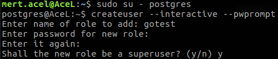
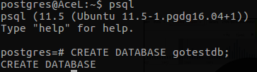

# Postgre SQL

## Postgre SQL Yükleme

### Ubuntu 18 için

```bash
sudo echo "deb http://apt.postgresql.org/pub/repos/apt/ bionic-pgdg main" > /etc/apt/sources.list.d/pgdg.list
```

```bash
wget --quiet -O - https://www.postgresql.org/media/keys/ACCC4CF8.asc | sudo apt-key add -
sudo apt-get update
```

```bash
sudo apt-get install postgresql-11
```

```bash
sudo su - postgres
createuser --interactive --pwprompt
```

Karşımıza gelen seçenekte kullanıcı adını aşağıdaki gibi doldurun



ardından aşağıdaki adımları izleyerek db oluşturun

