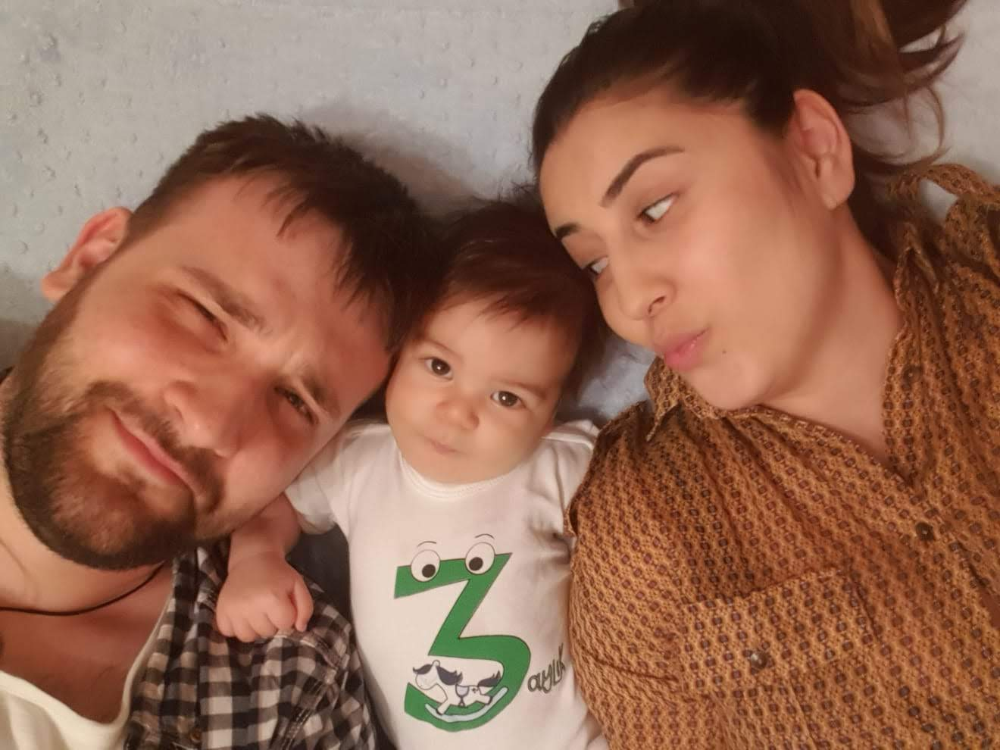
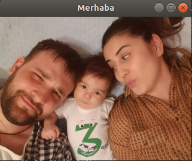
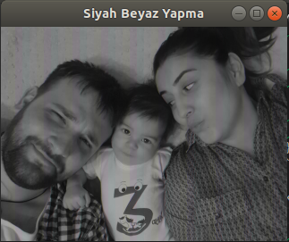
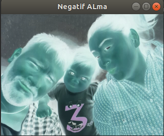
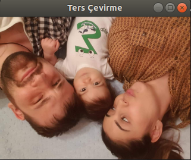
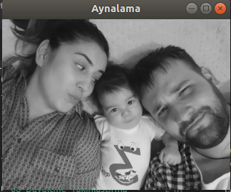
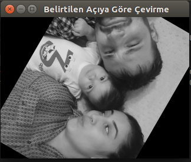
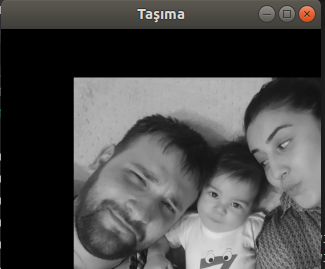

# **Görüntü İşleme ve GOCV**

 Bu bölümde görüntü işlemeye başlangıç yapılacaktır. Temel kavram ve teknikler öğretilmeyi hedeflenmiştir. Ders Kapsamında, **"GOCV"** kütüpanesi kullanılacaktır. Yapılan işlemler hem piksel bazında nasıl yapıldığı anlatılacak, hemde **"GOCV"** paketinde kullanım yöntemi gösterilecektir.

## **GOCV**

**"GOCV"**, **"Hybridgroup"** tarafından **"Opencv"** kütüphanesinin **"Go"**ya uyarlanmış halidir. Şu an **Opencv**'nin resmi olarak **Go** kütüphanesi yoktur. Fakat **GOCV** oldukça iyi hazırlanmıştır. **GOCV** için **"<https://gocv.io/>"** adresine bakabilirsiniz.

### **Yükleme**

**GOCV** yüklemek için aşağıdaki komutları çalıştırın.

```bash
go get -u -d gocv.io/x/gocv
cd $GOPATH/src/gocv.io/x/gocv
make install
```

Eğer bir hata almadıysanız, artık çalışmalara başlayabiliriz.

## **Görüntü İşlemeye Giriş**

Bu bölümde, fotoğraf üzerinde bazı işlemler yapıp, filtreler uygulayacağız. Görüntü işlemenin temeline bakacağız.

Bu bölümde **"MERT_KUBRA_ERDEM.jpg"** üstünde işlemler yapacağız.

 

### **Merhaba Dünya**

Programlamada bir şeye başlanıyorsa, gelenek olarak **"Merhaba Dünya"** projesi ile başlanır. Bizde geleneği bozmayarak ilk projemize başlıyoruz. Bu projede, bir resmi nasıl açacağımızı inceleyeceğiz.

İlk olarak **"GOCV"** paketimizi projeye ekliyoruz;

```go
import (
    "gocv.io/x/gocv"
)
```

Sıradaki adım olarak yeni bir pencere oluşturmamız gerekmekte. Açacağımız resim bu pencerede görülecek.

```go
window := gocv.NewWindow("Merhaba")
```

Resimler aslında bir matris şeklinde sayısal bir ifadedir. Sıradaki adımda, açılacak olan resmin, sayısal ifadelerini barındıran, **gocv** paketinde bulunan bir **"Mat"** türünde değişken tanımlıyoruz.

```go
img := gocv.NewMat()
```

Artık resmimizi okuyup, tanımladığımız değişkenin içine yazma vakti geldi. Bunun için **"IMRead"** fonksiyonunu kullanıyoruz. Bu fonksiyon **2** parametre almaktadır. 1. parametre üstünde çalışılacak görüntünün yolu, diğeri ise resmi okuma bayrağı. Biz bu projede, görüntünün orjinal halini istediğimiz için **"IMReadColor"** parametresini kullandık.

```go
img = gocv.IMRead("../MERT_KUBRA_ERDEM.jpg", gocv.IMReadColor)
```

Artık resmimizi ekranda görmenin vakti geldi. Oluşturduğumuz **"window"** nesnesinin **"IMShow"** fonksiyonunu kullanıyoruz.

```go
window.IMShow(img)
```

Son adım olarak, aılan pencerenin ekranda kalma süresini belirtiyoruz. Bunun için, **"WaitKey"** fonksiyonunu kullanıyoruz. Eğer **0** verirsek, biz kapatana kadar kalmaya devam edecektir.

```go
window.WaitKey(0)
```

**NOT : Bu proje, ilk olduğu için uzun uzun anlattık. Bundan sonraki projelerde, daha önce anlatılan kısımlara yer verilmeyecektir.**

Şimdi bütün programı görelim.

```go
package main

import (
    "gocv.io/x/gocv"
)

func main() {
    window := gocv.NewWindow("Merhaba")
    img := gocv.NewMat()
    img = gocv.IMRead("../MERT_KUBRA_ERDEM.jpg", gocv.IMReadColor)

    window.IMShow(img)
    window.WaitKey(0)
}
```

Projeyi çalıştırdığımızda, aşağıdaki gibi ekrana bir pencere gelecektir.



### **Görüntüyü Siyah Beyaz Yapma**

Görüntü işlemede, resimleri siyah - beyaz yapma oldukça önemli yer kaplamaktadır. Siyah beyaz görüntü iki boyutludur. Her piksel değeri 0 ile 255 arasında değer alır. Fakat renkli görüntüde üç boyut devreye girer ve her bir boyut için işlem yapmak gerekir.

Bir resmi siyah beyaz yapmak için;

#### **Yöntem 1**

İlk yöntem, ilgili fotoğrafın programa alınırken siyah beyaz olmasını belirtmek. Bunun için, **"IMRead"** fonksiyonun ikinci parametresine **"gocv.IMReadGrayScale"** olarak vermek;

```go
img = gocv.IMRead("../MERT_KUBRA_ERDEM.jpg", gocv.IMReadGrayScale)
```

#### **Yöntem 2**

İkinci yöntem, görüntüyü orjinal haliyle alıp, **"CvtColor"** fonksiyonu ile çevirmek. Bu fonksiyon 3 parametre almaktadır.

* İlk parametre, **okunacak olan görüntü**.

* İkinci parametre, **okunduktan ve işlem yapıldıktan sonra yeni resmin yazılacağı "Mat" türündeki değişken**, biz bu projede, ilk görüntünün alındığı değişkene tekrar yazıyoruz. İstersek farklı bir değişken oluşturup onada aktarabiliriz.

* Üçüncü paremetre ise **değişeceği türü** belirtiyoruz. Bizim resmimiz renkli (BGR = Blue-Green-Red) olduğu için **"ColorBGRToGray"** parametresini kullanıyoruz

```go
img = gocv.IMRead("../MERT_KUBRA_ERDEM.jpg", gocv.IMReadAnyColor)
gocv.CvtColor(img, &img, gocv.ColorBGRToGray)
```

#### **Yöntem 3**

Bu yöntemde ise, her bir piksel üzerinde işlem yaparak sonucumuza ulaşıyoruz. Her bir piksel üzerinde işlem yapabilmek için **"for"** döngülerinden yararlanıyoruz. Bu yapı, bundan sonraki bölümlerde de oldukça kullanacağız. Bizim resmimizin bir boyutu bulunmakta. Bu boyutta satır ve sütunlar yer almaktadır. Her bir pikselin **"x,y"** koordinatları vardır. Bu kordinatlar içerisinde gezinmek için aşağıdaki yapıyı kullanmaktayız. Bu yapıda 2 fonksiyon kullanıyoruz.

* img.Rows() bize içeri aktardığımız resimdeki toplam satır sayısını vermektedir. Döngüden gelecek her bir değerde ilgilendiğimiz pikselin **"x"** koordinatını verecektir.

* img.Cols() bize içeri aktardığımız resimdeki toplam sütun sayısını vermektedir. Döngüden gelecek her bir değerde ilgilendiğimiz pikselin **"y"** koordinatını verecektir.

```go
for i := 0; i < img.Rows(); i++ {
    for j := 0; j < img.Cols(); j++ {

    }
}
```

İlk olarak resmin içindeki, belirli bir konumda bulunan pikselin değerini alıyoruz. Bunun için **"GetIntAt"** fonksiyonunu kullanıyoruz. Bu fonksiyon, iki paremetre alıyor.

* İlk paremetre, pikselin **x** değerini alıyor.

* İkinci paremetre, pikselin **y** değerini alıyor.

```go
p := img.GetIntAt(x, y)
```

Gelen piksel, içinde **RGBA(Red, Green, Blue, Alpha)**  yani kırmızı, yeşil, mavi ve saydamlık değerlerini barındıran, **integer** türünde bir sayı. Şimdide bu sayıyı ayrıştırıyoruz. Saydamlık derecesini kullanmadığımızdan dolayı onu açıklama satırı haline getirdik.

```go
//a := (p >> 24) & 0xff
r := (p >> 16) & 0xff
g := (p >> 8) & 0xff
b := (p >> 0) & 0xff
```

Sıradaki adım ise, bu değerleri gri formata dönüştürmek için gerekli formülü kullanmada. Bunun için 3 formül bulunmaklta. Bunlar ;

* Formül 1 : grayValue=(0.299*r)+(0.587*g)+(0.114*b)

* Formül 2 : grayValue=(0.21*r)+(0.71*g)+(0.071*b)

* Formül 3 : grayValue = (r + g + b) / 3

En doğru sonuçlar için biz **Formül 1** kullanacağız.

```go
grayValue := float32(r)*0.299 + float32(g)*0.587 + float32(b)*0.114
```

Sıradaki adım olarak her renk değerine bu formülden çıkan **grayValue** değerini atayacağız.

```go
r = int32(grayValue)
g = int32(grayValue)
b = int32(grayValue)
```

Ardından bu değerleri bir değişkende birleştiriyoruz.

```go
pTotal := (r << 16) | (g << 8) | b
```

Son olarak, ilgili piksele yeni oluşturduğumuz değeri yazıyoruz. Bunun için **"SetIntAt"** fonksiyonunu kullanacağız. Bu fonksiyon 3 değer alıyor. Bunlar;

* İlk paremetre, pikselin **x** değeri..

* İkinci paremetre, pikselin **y** değeri.

* Üçüncü parametre, piksele atanacak değer.

```go
img.SetIntAt(x, y, pTotal)
```

Kodun tam hali şu şekilde ;

```go
package main

import (
    "gocv.io/x/gocv"
)

/*
Formül 1 : grayValue=(0.299*r)+(0.587*g)+(0.114*b)
Formül 2 : grayValue=(0.21*r)+(0.71*g)+(0.071xb)
Formül 3 : grayValue = (r + g + b) / 3
*/
func main() {

    img := gocv.NewMat()

    // 1. Yöntem : İlk görüntüyü yüklerken
    //img = gocv.IMRead("../MERT_KUBRA_ERDEM.jpg", gocv.IMReadGrayScale)

    // 2. Yöntem : Görüntüyü normal alıp değiştirme
    img = gocv.IMRead("../MERT_KUBRA_ERDEM.jpg", gocv.IMReadAnyColor)
    //gocv.CvtColor(img, &img, gocv.ColorBGRToGray)

    // 3. Yöntem : Manuel olarak döndürme
    for x := 0; x < img.Rows(); x++ {
        for y := 0; y < img.Cols(); y++ {

            p := img.GetIntAt(x, y)

            //a := (p >> 24) & 0xff
            r := (p >> 16) & 0xff
            g := (p >> 8) & 0xff
            b := (p >> 0) & 0xff

            //Gri-ton formülü
            grayValue := float32(r)*0.299 + float32(g)*0.587 + float32(b)*0.114

            r = int32(grayValue)
            g = int32(grayValue)
            b = int32(grayValue)

            pTotal := (r << 16) | (g << 8) | b
            img.SetIntAt(x, y, pTotal)
        }
    }

    window := gocv.NewWindow("Siyah Beyaz Yapma")
    window.SetWindowProperty(gocv.WindowPropertyAutosize, gocv.WindowAutosize)

    window.IMShow(img)
    window.WaitKey(0)
}
```

Kodu çalıştırdıktan sonra ekrana çıkan sonuç;



### **Negatif Alma**

Görüntü işlmede diğer önemli yöntem görüntünün negatifini almaktır. Bunun için izlenecek yollar aşağıdadır. Bu proje 3 boyut yani renkli bir görüntü üzerinde gösterilecektir. Bundan sonraki bölümlerde, resim siyah beyaza döndürülüp gösterilecektir.

#### **Yöntem 1**

Bu yöntem, gocv paketinde bulunan **"BitwiseNot" fonksiyonu ile yapılmaktadır. Bu fonksiyon iki parametre alır.

* İlk parametre görüntünün alınacağı **Mat** türündeki değişken.

* İkinci parametre, görüntü terslendikten sonra aktarılacağı **Mat** türündeki değişken.

```go
gocv.BitwiseNot(img, &img)
```

#### **Yöntem 2**

Bu yöntemde yöne piksel piksel işlem yapılacaktır. Görüntünün tersini almak için kullanacağım formül **f(x;y)=255-g(x;y)**. Bu formüle göre, her piksel değeri 255 ten çıkartılacak. Projemizde, yapılan her işlemden sonra sonucu, yeni bir matrise yazacağız. Bunun için ilk önce **"imgTotal"** isminde bir matris oluşturacağız.

```go
img2 := gocv.NewMat()
```

Bu matrisi 2 yol ile boyutlandırabiliriz. Bu projede, var olan matrisi, yani resmi ilk açtığımızda aktardığımız değişken olan **"img"** değişkenini kopyalarak yaptık. Böylece aynı boyutlarda ve özelliklerde olmuş oldu. Bunun için **CopyTo** fonksiyonunu kullandık.

```go
img.CopyTo(&img2)
```

Sıradaki adımda ise **255** sayısından ilgili koordinatlarda bulunan pikselin değerini çıkartıp, yeni oluşturduğumuz matrise yazıyoruz

```go
for x := 0; x < img.Rows(); x++ {
    for y := 0; y < img.Cols(); y++ {
        imgTotal.SetIntAt(x, y, 255-img.GetIntAt(x, y))
    }
}
```

#### **Yöntem 3**

Bİr önceki bölümde yapılan çözüm her ne kadar çalışsada, aslında olması gereken her pikselin renklerini ayrıştırıp, her renkte bu işlemi yapıp tekrar birleştirmektir. Bunun için ;

```go
for x := 0; x < img.Rows(); x++ {
    for y := 0; y < img.Cols(); y++ {
        p := img.GetIntAt(x, y)

        a := (p >> 24) & 0xff
        r := (p >> 16) & 0xff
        g := (p >> 8) & 0xff
        b := p & 0xff

        // 255 ten pikseldeki renkleri çıkartıyoruz
        a = 255 - a
        r = 255 - r
        g = 255 - g
        b = 255 - b

        //Yeni değerleri piksele giriyoruz
        pTotal := (r << 24) | (r << 16) | (g << 8) | b

        imgTotal.SetIntAt(x, y, pTotal)
    }
}
```

Böylece resmimizin negatif değerini almış oluyoruz. Kodun tam hali aşağıdaki gibidir.

```go
package main

import (
    "gocv.io/x/gocv"
)

// f(x;y)=255-g(x;y)

func main() {

    img := gocv.NewMat()
    imgTotal := gocv.NewMat()

    img = gocv.IMRead("../MERT_KUBRA_ERDEM.jpg", gocv.IMReadAnyColor)
    img.CopyTo(&imgTotal)

    // Yöntem 1 :
    //gocv.BitwiseNot(img, &img)

    // Uzun Yöntem :
    for x := 0; x < img.Rows(); x++ {
        for y := 0; y < img.Cols(); y++ {

            // 1. Uzun yöntem
            //imgTotal.SetIntAt(x, y, 255-img.GetIntAt(x, y))

            //2. Dahada uzun yötem
            p := img.GetIntAt(x, y)

            a := (p >> 24) & 0xff
            r := (p >> 16) & 0xff
            g := (p >> 8) & 0xff
            b := p & 0xff

            // 255 ten pikseldeki renkleri çıkartıyoruz
            a = 255 - a
            r = 255 - r
            g = 255 - g
            b = 255 - b

            //Yeni değerleri piksele giriyoruz
            pTotal := (r << 24) | (r << 16) | (g << 8) | b

            imgTotal.SetIntAt(x, y, pTotal)
        }
    }

    window := gocv.NewWindow("Negatif ALma")
    window.SetWindowProperty(gocv.WindowPropertyAutosize, gocv.WindowAutosize)

    window.IMShow(imgTotal)
    window.WaitKey(0)
}
```

Kodları çalıştırdıktan sonra gelen sonuç şu şekildedir.



### **Ters Çevirme**

Bu bölümde resmi 180 derece açı ile çevirmeyi göreceğiz.

#### **Yöntem 1**

İlk yöntemde, gocv paketinin **Rotate** fonksiyonu kullanalark bu işlemi gerçekleştireceğiz. Bu fonksiyon üç paremetre almakta. Bunlar;

* İlk parametre, verinin alınacağı resmin atandığı **Mat** türündeki matris değişkeni.

* İkinci parametre, işlem yapıldıktan sonra verilerin yazılacağı **Mat** türündeki matris değişkeni.

* Üçüncü parametre döndürme yöntemi. Biz ters döndürmek istediğimiz için **Rotate180Clockwise** parametresini kullandık. Bunun dışında **Rotate90Clockwise** ve **Rotate90CounterClockwise** parametreleride bulunmakta.

```go
gocv.Rotate(img, &img, gocv.Rotate180Clockwise)
```

#### **Yöntem 2**

Bu yöntemde ilk adım olarak yeni bir **Mat** tipinde değişken oluşturuyoruz.

```go
imgTotal := gocv.NewMat()
```

Daha önce yeni oluşturduğumuz matrisimizi formatlarken, **Mat** yapısının **CopyTo** fonksiyonunu kullanmıştık. Şimdi ise daha kullanışlı olan gocv paketinin **"NewMatWithSize"** fonksiyonunu kullanacağız. Bu fonksiyon üç parametre olmakta.

* İlk parametre, yeni oluşturduğumuz matrisin satır uzunluğu,

* İkinci parametre, yeni oluşturduğumuz matrisin sütun uzunluğu,

* Üçüncü parametre, matrisin tipini belirliyor. Biz, **MatTypeCV8UC3** olarak belirledik. Bu sabitin anlamı, matrsin 8 bit ve 3 kanal olacağı manasına gelmektedir. Eğer resmimiz siyah beyaz bir resim olsaydı **"MatTypeCV8U"** olarak vermemiz gerekecekti.

```go
imgTotal = gocv.NewMatWithSize(img.Rows(), img.Cols(), gocv.MatTypeCV8UC3)
```

Ters çevirme formülümüz, **"f(x,y)=(H - x,y)"**. Yani H yüksekliğe sahip bir piksel H - x koordinatına taşınacaktır. Biz toplam yüksekliği img.Rows() fonksiyonu ile alıyoruz.

```go
h := img.Rows()
for x := 0; x < img.Rows(); x++ {
    for y := 0; y < img.Cols(); y++ {
        p := img.GetIntAt(x, y)

        newX := h - x
        newY := y

        imgTotal.SetIntAt(newX, newY, p)
    }
}
```

Kodumuzun tam hali şu şekildedir;

```go
package main

import (
    "gocv.io/x/gocv"
)

/*
h = Toplam Yükseklik
f(x,y)=(H - x,y)
*/

func main() {

    img := gocv.NewMat()
    img = gocv.IMRead("../MERT_KUBRA_ERDEM.jpg", gocv.IMReadAnyColor)

    // Yöntem 1 :
    //gocv.Rotate(img, &img, gocv.Rotate180Clockwise)

    // Uzun Yöntem :
    imgTotal := gocv.NewMat()
    imgTotal = gocv.NewMatWithSize(img.Rows(), img.Cols(), gocv.MatTypeCV8UC3)

    h := img.Rows()
    for x := 0; x < img.Rows(); x++ {
        for y := 0; y < img.Cols(); y++ {
            p := img.GetIntAt(x, y)

            newX := h - x
            newY := y

            imgTotal.SetIntAt(newX, newY, p)
        }
    }

    window := gocv.NewWindow("Ters Çevirme")
    window.SetWindowProperty(gocv.WindowPropertyAutosize, gocv.WindowAutosize)

    window.IMShow(imgTotal)
    window.WaitKey(0)
}
```

Kodu çalıştırdığımızda sonuç aşağıdaki gibidir.



### **Aynalama**

Bu projemizde resmi aynalayacağız. Fark olarak, bu sefer resim siyah beyaz olacak.

#### **Yöntem 1**

Bu yöntemde yine çok kullanışlı olan gocv paketinin **"Flip"** fonksiyonu göreceğiz. BU fonksiyon 3 paremetre almakta. Bunlar ;

* İlk parametre işlem yapılacak resmin bulunduğu **Mat** tipindeki değişken,

* İkinci parametre işlem sonrası değişikliklerin aktarılacağı **Mat** tipindeki değişken,

* Üçüncü paremetre ise yapılacak işlem. Yatay(0), Dikey(1), Her ikiside(-1)

```go
gocv.Flip(img, &img, 1)
```

#### **Yöntem 2**

Bu yöntemde kulanılacak formül, **f(x,y)=(x,W - y)**. Burada bulunan **W** toplam genişlik anlamına gelmektedir.

Resmimiz siyah beyaz almak istediğimiz için olduğu için, ana matrisimizde ikinci parametre **IMReadGrayScale** ve yeni oluşturduğumuz matrisimizde ise matris tipimiz **MatTypeCV8U** olacak.

```go
img = gocv.IMRead("../MERT_KUBRA_ERDEM.jpg", gocv.IMReadGrayScale)
imgTotal = gocv.NewMatWithSize(img.Rows(), img.Cols(), gocv.MatTypeCV8U)
```

Sonraki adımda, yine döngümüzün içinde formülümüzü uygulayalım.

```go
w := img.Cols()
for x := 0; x < img.Rows(); x++ {
    for y := 0; y < img.Cols(); y++ {
        p := img.GetUCharAt(x, y)

        newX := x
        newY := w - y

        imgTotal.SetUCharAt(newX, newY, p)
    }
}
```

Kodun tam hali aşağıdaki gibidir.

```go
package main

import (
    "gocv.io/x/gocv"
)

/*
W = Toplam Genişlik
f(x,y)=(x,W - y)
*/

func main() {

    img := gocv.NewMat()
    img = gocv.IMRead("../MERT_KUBRA_ERDEM.jpg", gocv.IMReadGrayScale)

    // Yöntem 1 :
    //gocv.Flip(img, &img, 1)

    // Uzun Yöntem :
    imgTotal := gocv.NewMat()
    imgTotal = gocv.NewMatWithSize(img.Rows(), img.Cols(), gocv.MatTypeCV8U)
    w := img.Cols()
    for x := 0; x < img.Rows(); x++ {
        for y := 0; y < img.Cols(); y++ {
            p := img.GetUCharAt(x, y)

            newX := x
            newY := w - y

            imgTotal.SetUCharAt(newX, newY, p)
        }
    }

    window := gocv.NewWindow("Aynalama")
    window.SetWindowProperty(gocv.WindowPropertyAutosize, gocv.WindowAutosize)

    window.IMShow(imgTotal)
    window.WaitKey(0)
}
```

Kodları çalıştırdığımızda karşımıza çıkan sonuç şu şekildedir.



### **Belirtilen Açıya Göre Çevirme**

Bu projede, verilen açı değeri kadar çevirmeyi göreceğiz.

#### **Yöntem 1**

Bu yöntemde, gocv paketinin sunduğu fonksiyonlar yardımıyla işlemlerimi gerçekleştireceğiz.

İlk olarak, **"GetRotationMatrix2D"** ile bir matris oluşturacağız. Bu fonksiyon, bize nasıl özelliklerde oalcağını bildiriyor. Bu fonksiyon 3 parametre alıyor.

* Birinci parametre, Go'nun kendi paketlerinden olan **"image"** paketinin, **"Point"** yapısı. Bu yapı, **X** ve **Y** koordinatlarını alıyor. Bu koordinatlar, resimin dönme merkezini belirliyor. Biz, **"X: img.Cols() / 2, Y: img.Rows() / 2"** şeklinde aldığımızda, orta noktadan dönmesi gerektiğini belirtiyoruz.

* İkinci parametre dönme açısını belirtiyor. Açı + olursa saat yönünün tersi, - olursa saat yönünde döner

* Üçüncü parametre ise yakınlaştırma derecesini belirtiyor. Bu değer eğer **1** ise normal boyutu anlamına gelmektedir.

```go
rotationMatrixSettings := gocv.GetRotationMatrix2D(image.Point{X: img.Cols() / 2, Y: img.Rows() / 2}, 100, 1)
```

Ardıdnan gocv paketinin **"WarpAffine"** fonksiyonunu kullanıyoruz. Bu fonksiyon 4 parametre almakta.

* İlk parametre, işlemin yapılacağı ana kaynağı belirten matris,

* İkinci parametre, işlemlerden sonra değişikliklerin aktarılacağı matris,

* Üçüncü parametre, **GetRotationMatrix2D** fonksiyonundan gelen matris.

* Dördüncü parametre, çıktının görnütsünün boyutunu belirtmektedir. Eğer özel bir amacınız yoksa **0,0** veriniz.

```go
gocv.WarpAffine(img, &imgTotal, rotationMatrixSettings, image.Point{X: 0, Y: 0})
```

### **Yöntem 2**

Bu yöntemde, bir formül kullanacağız. Bu formül, **x** için, **x1 = cosθ(x - x0) - sinθ(y-y0) + x0**, y için, **y1 = sinθ(x - x0) - cosθ(y-y0) + y0**

İlk olarak **x0** ve **y0** değişkenlerini oluşturuyoruz. Bu değişkenler, dönüş merkezini belirtiyor.

```go
x0 := img.Rows() / 2
y0 := img.Cols() / 2
```

Ardından dönüş açısını tanımlıyoruz ve gerekli olan işlemi gerçekleştiriyoruz.

```go
angleValue := 100.0
angle := angleValue * 2 * math.Pi / 360
```

Son olarak, verilen formülü uyguluyoruz. Burada faklı olarak bir **"if"** bloğu yer almakta. İşlemler sonrası, bazı değerler negatif yada matrisin büyüklüğünden daha büyük değerler olabilir. Matrisimize eklerken hataya sebep olabilir. Bunu engellemek için gerekli işlemleri yapıyoruz.

```go
for i := 0; i < img.Rows(); i++ {
    for j := 0; j < img.Cols(); j++ {
        p := img.GetSCharAt(i, j)

        newX := int(math.Cos(angle)*float64(i-x0) - math.Sin(angle)*float64(j-y0) + float64(x0))
        newY := int(math.Sin(angle)*float64(i-x0) - math.Cos(angle)*float64(j-y0) + float64(y0))

        if newX >= 0 && newX < imgTotal.Rows() && newY >= 0 && newY < imgTotal.Cols() {
            imgTotal.SetUCharAt(newX, newY, uint8(p))
        }
    }
}
```

Programın tam hali şu şekildedir;

```go
package main

import (
    "math"
    "gocv.io/x/gocv"
)

/*
  x1 = cosθ(x - x0) - sinθ(y-y0) + x0
  y1 = sinθ(x - x0) - cosθ(y-y0) + y0
*/

func main() {
    img := gocv.IMRead("../MERT_KUBRA_ERDEM.jpg", gocv.IMReadGrayScale)

    imgTotal := gocv.NewMatWithSize(img.Rows(), img.Cols(), gocv.MatTypeCV8U)
    // Yöntem 1 :
    //Açı + olursa saat yönünün tersi, - olursa saat yönünde döner
    /*rotationMatrixSettings := gocv.GetRotationMatrix2D(image.Point{X: img.Cols() / 2, Y: img.Rows() / 2}, 100, 1)
    gocv.WarpAffine(img, &imgTotal, rotationMatrixSettings, image.Point{X: 0, Y: 0})*/

    // Uzun Yöntem :
    x0 := img.Rows() / 2
    y0 := img.Cols() / 2

    angleValue := 100.0
    angle := angleValue * 2 * math.Pi / 360

    for i := 0; i < img.Rows(); i++ {
        for j := 0; j < img.Cols(); j++ {
            p := img.GetSCharAt(i, j)

            newX := int(math.Cos(angle)*float64(i-x0) - math.Sin(angle)*float64(j-y0) + float64(x0))
            newY := int(math.Sin(angle)*float64(i-x0) - math.Cos(angle)*float64(j-y0) + float64(y0))

            if newX >= 0 && newX < imgTotal.Rows() && newY >= 0 && newY < imgTotal.Cols() {
                imgTotal.SetUCharAt(newX, newY, uint8(p))
            }
        }
    }

    window := gocv.NewWindow("Belirtilen Açıya Göre Çevirme")
    window.SetWindowProperty(gocv.WindowPropertyAutosize, gocv.WindowAutosize)

    window.IMShow(imgTotal)
    window.WaitKey(0)
}
```

Kodları çalıştırdığımızda sonuç şu şekilde olacaktır;



### Görüntü Taşıma

Bu bölümde, görüntüyü taşımayı inceleyeceğiz.

Görüntü taşıma, **bütün** piksellerin x ve y değerine, belirttiğimiz bir sayıyı eklemektir. Formül olarak şu şekilde ifade ediyoruz, **(x,y) = (x+A,y+B)**

Bu kolay bir yöntem olduğu için, bütün kodu verelim;

```go
package main

import (
    "gocv.io/x/gocv"
)

/*
(x,y) = (x+A,y+B)
*/

func main() {

    img := gocv.IMRead("../MERT_KUBRA_ERDEM.jpg", gocv.IMReadGrayScale)
    imgTotal := gocv.NewMatWithSize(img.Rows(), img.Cols(), gocv.MatTypeCV8U)

    a := 200
    b := 300

    for x := 0; x < img.Rows(); x++ {
        for y := 0; y < img.Cols(); y++ {

            p := img.GetUCharAt(x, y)

            newX := x + a
            newY := y + b

            if newX >= 0 && newX <= imgTotal.Rows() && newY >= 0 && newY <= imgTotal.Cols() {
                imgTotal.SetUCharAt(newX, newY, p)
            }
        }
    }

    window := gocv.NewWindow("Taşıma")
    window.SetWindowProperty(gocv.WindowPropertyAutosize, gocv.WindowAutosize)

    window.IMShow(imgTotal)
    window.WaitKey(0)
}
```

Kodları çalıştırdığımızda ekran şu şekilde olacaktır.



### Büyültme - Yakınlaştırma


## **Kaynak**

> <https://gocv.io/>
>
> <https://opencv.org/>
>
> Ahmet Yesevi Üniversitesi - Türtep
>
> <http://www.ibrahimcayiroglu.com>
>
> <http://web.firat.edu.tr>